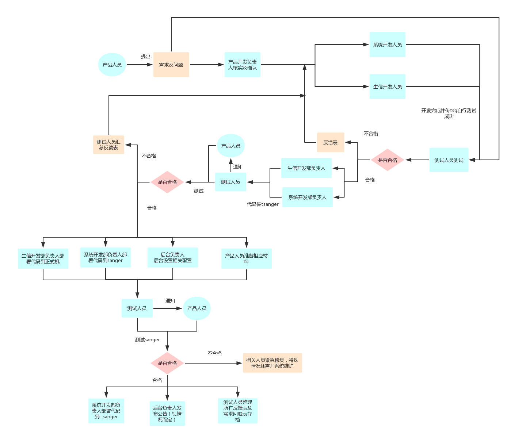
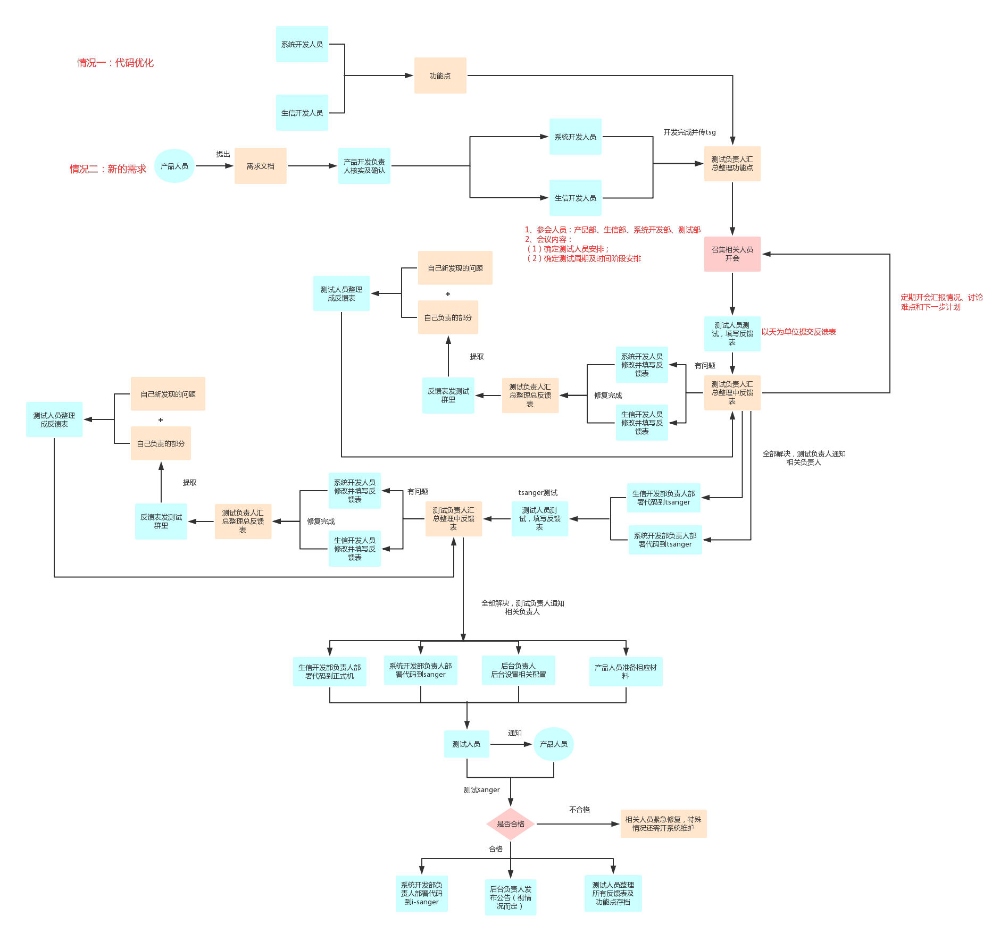

> 流程测试是为了检验产品开发的成果，确保上线前所开发产品的完整性及准确性。产品测试的目的是为了确定改进后的产品是否比改进前的好，操作上是否顺畅，能否满足客户的需求，让客户使用起来更便捷。{-测试极其重要，每一环节都需要严格把关-}。

### 测试类型：
对于云平台来说，测试按照规模分为两类，一种是`小规模的需求及问题处理`,另一种是`大规模的新产品开发及优化`。

#### 小规模测试流程

##### 规范
`产品人员`：  

>1、产品人员必须提供{-比较完善的需求及问题说明文档，命名：主要内容+反馈人+时间-}，可图文并茂，但必须能够说明清楚需求和问题，否则产品开发负责人有权对需求问题算无效处理；  
>2、开发完成，产品人员测试时，发现的问题也需整理成反馈表交给测试人员汇总处理。

`开发人员`：
>1、开发人员开发需满足满足产品人员提出的需求及问题；如需变动，则需要和产品人员沟通协调，必要时可组织会议，与相关人员商讨，重新确定方案，结果必须以{-完整的需求问题说明文档-}形式达成一致并交付给产品开发负责人；  
>2、开发人员自己开发的内容完成后在传tsg后需自行测试准确性后方可联系测试人员；
>3、开发人员仅收到反馈表，以反馈表中反馈的内容修复开发过程中的问题，并将状态及解决原因标记在表中，在极短的时间内将表反馈给测试人员核实。

`测试人员`：
>1、测试人员测试前提：（1）确定开发人员已经在tsg测试没有问题；（2）收到比较完善的需求问题文档说明；否则有权利延期或拒绝测试；  
>2、测试所有问题必须记录在反馈表中，方可提交给开发人员进行修复，  
>3、测试人员在整个流程上线后需将所有的需求问题文档和测试反馈总表整理存档。  
>4、测负责试人进度跟进：
- （1）tsg上问题/需求处理情况；
- （2）与产品线确定测试周期和时间阶段安排；
- （3）tsanger上测试反馈及处理情况；
- （4）确定tsanger上测试没有问题后通知产品人员测试；
- （5）确定产品人员在tsanger上测试没有问题后通知:1、生信开发部负责人部署代码到正式机；2、系统开发部负责人部署代码到sanger；3、后台负责人后台设置相关配置；4、产品人员准备相应材料。
- （6）代码推至sanger后通知产品人员测试；
- （7）sanger无问题后通知：1、系统开发部负责人部署代码到i-sanger；2、后台负责人发布公告（视情况而定）；3、测试人员整理所有反馈表及需求问题表存档。

`其他注意事项`：
>1、所有问题及说明必须以文件形式存在为准，发在群里或者口头描述的问题不算，需整理成文档形式；
>2、所有开发人员和测试人员都需格式严格按照[测试反馈表模板](../examples/反馈表模板.xlsx)（如有特殊需求，可微调反馈表格式）。

#### 大规模测试流程

##### 规范
`测试内容明确`
>1、新需求的开发产品部需提供需求文档、代码优化开发人员需提供功能点及注意事项，测试人员统一整理汇总。

`测试进度有序`  

>1、时间周期比较长的测试需有明确的时间进度安排，召开会议，相关人员参会确定时间进度；  
>2、会议中明确整个时间周期内设定的每个{-时间阶段-}，每一两个阶段需开一次大会汇报进度和情况以及测试过程中遇到的细节问题，难点等，讨论确定方案（开大会的时间后期可根据实际测试情况进行调整）；  
>3、会议召集人（即测试负责人）需在会后对会议内容进行整理，重点标出每个功能点安排的测试人员及每个时间阶段，{-邮件发送-}相关人员，必要时也需抄送对应的测试人员的领导，方便领导知道情况；  
>4、测试人员尽量{-一天-}整理一次反馈表给测试负责人整理,达到及时修复，确保测试进度的进行。

`反馈规范`
>1、所有问题及说明必须以文件形式存在为准，发在群里或者口头描述的问题不算，需整理成文档形式；  
>2、测试人员反馈表命名：{-测试主题+测试人+表提交时间；反馈总表命名：测试主题+时间-}；  
>3、为了节省测试负责人的整理工作，所有开发人员和测试人员都需格式严格按照[测试反馈表模板](../examples/反馈表模板.xlsx)（如有特殊需求，可微调反馈表格式），如有补充，请放入“备注”中或后面其他单元格，如有特殊需求需开会统一调整模块，切勿私自随意修改表格格式；  
>4、每次测试负责人将上一批修改的情况发到测试群中，涉及自己测试发现的问题自己需要核实是否与反馈表中开发人员填写的状态一致，并将结果与下一次反馈表整理一同提交；  
（即将群中上次表中自己负责的内容复制出来，贴到下次反馈表中，并填写“核实情况”一栏，如有问题，如实记录，如引发新的问题，该问题记完成，另起一行记录新问题）。

`反思与总结`：
>1、开发人员需要填写反馈表中的"问题解决方案"，避免以后再犯同样错误，也方便后续人员知道如何修改；  
>2、测试负责人在上线后整理总反馈表，并存档；  
>3、测试负责人在上线后补充功能点，完善测试过程中发现的功能点，整理存档。
