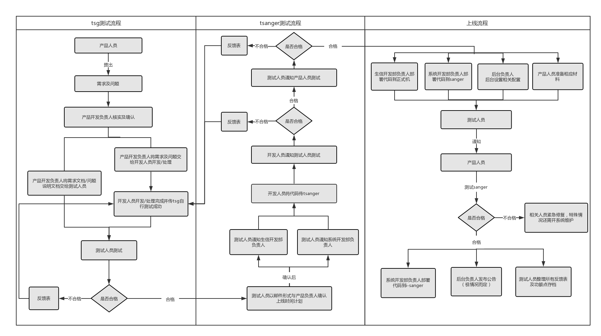

> 流程测试是为了检验产品开发的成果，确保上线前所开发产品的完整性及准确性。产品测试的目的是为了确定改进后的产品是否比改进前的好，操作上是否顺畅，能否满足客户的需求，让客户使用起来更便捷。{-测试极其重要，每一环节都需要严格把关-}

### 测试类型：
对于云平台来说，测试按照规模分为两类，一种是`小规模的需求及问题处理`,另一种是`大规模的新产品开发及优化`

#### 小规模测试流程

##### 规范
`产品人员`：  

>1、产品人员必须提供{-比较完善的需求及问题说明文档-}，可图文并茂，但必须能够说明清楚需求和问题，否则产品开发负责人有权对需求问题算无效处理；

`开发人员`：
>1、开发人员开发需满足满足产品人员提出的需求及问题；如需变动，则需要和产品人员沟通协调，必要时可组织会议，与相关人员商讨，重新确定方案，结果必须以{-完整的需求问题说明文档-}形式达成一致并交付给产品开发负责人；  
>2、开发人员自己开发的内容完成后需自行测试准确性，在传tsg后也需自行测试准确性后方可联系测试人员；
