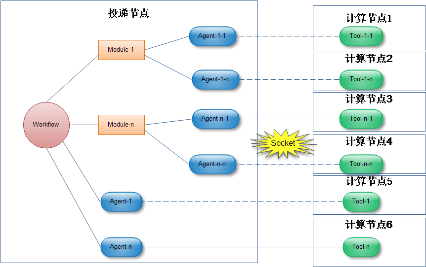

Biocluster教程系列
==================
author：郭权

* [概述](#user-content-概述)
* [基础](/biocluster/Basic)
* [事件驱动编程](/biocluster/Event_Oriented)
* [Module/Workflow开发](/biocluster/Moudule_Workflow)
* [Tool/Agent开发](/biocluster/Tool_Agent)
* [运行和测试](/biocluster/Run_Test)

概述
=========================

-----------------------
开发环境要求
-----------------------

Python 2.7 : http://www.python.org/

推荐开发工具: Pycharm  : https://www.jetbrains.com/pycharm/download/

Python Packages:

	* Sphinx

	* gevent

	* psutil

	* zerorpc

	* fcntl (linux环境)

	* Mysql-python

	* web.py

	* pymongo

	* netaddr

-----------------------
框架解析
-----------------------

基本组成

Biocluster框架有3个主要的概念:

	* 流程(Workflow)

	* 模块(Module)

	* 工具及其代理 (Tool/Agent)

如下图所示:




   01 框架组成

- 流程(Workflow): 完成一个完整生信分析过程。
	Workflow只包含运行逻辑，不包含生信计算功能。
	Workflow通过定义自己的逻辑，调用一系列Module/Tool来共同完成任务。
	Workflow提供完整的运行环境，是可以独立运行的。

- 模块(Module):  可以重复利用的、完成一个特定的较复杂的生信功能。
	Module只包含运行逻辑，不包含生信计算功能。
	Module通过定义自己的逻辑，调用一系列Tool来完成特定的功能。
	Module没有完整的运行环境，必须通过Workflow调用才可以运行。

- 工具(Tool):  可以重复利用的，完成一个单一的生信功能。
	所有的生信计算功能都由Tool在远程节点上完成。
	Tool通过调用外部工具或者自定工具包(Package)来完成生信计算，并通过网络反馈运行状态到Agent。
	由于Tool在远程计算服务器运行，因此需要一个代理(Agent)负责与远程Tool进行通信,Tool与代理总是成对存在，一一对应，通过网络通信实现信息的互通。
	Tool没有完整的运行环境，必须通过Workflow调用才可以运行。


运行环境

Biocluster运行与计算机集群环境，基本要求如下：

	*	所有节点都安装相同版本的Linux，拥有相同的运行环境。

	*	使用集群文件系统，所有节点都使用共同的文件系统。即在任何节点下看到的文件都是一样的。

	*	拥有远程任务投递系统，可以进行远程任务投递。

	*	所有计算节点都可通过网络访问投递节点

- 投递节点: 运行Workflow/Module/Agent，主要控制运行环境，运行逻辑，网络通信和结果，不参与生信计算。

- 计算节点: 通过投递节点远程投递运行Tool,负责生信计算并监控运行状态，并返回给对应的Agent.


-----------------------
开发规范
-----------------------

目录结构


biocluster框架目录结构如下::

	app/                      程序安装目录
	biocluster/               框架根目录
	|- bin/                 框架相关的核心可执行程序
	|- log/					运行日志
	|- run/					运行时产生的PID文件
	|- doc/                 文档目录，存放说明文档
	|- examples/            示例目录，对于一些较复杂的使用情况可以通过编写示例，示例需要规范的名称和完整的注释
	|- scripts/             脚本目录，可以存放一些测试脚本
	|- src/                 核心源码目录
		|- biocluster/       框架核心库，此目录下不允许修改
		|- mbio/             自定义扩展库
			|- files/         文件格式库
			|- tools/         自定义工具库
			|- modules/       自定义模块库
			|- workflows/     自定义工作流程库
			|- packages/      自定义扩展生信功能包
	workspace/                工作目录


配置文件

biocluster框架由src/biocluster/main.conf文件配置管理，框架相关的参数均再次设置。

**注意:** src/biocluster/main.conf配置的参数是对整体框架产生影响的,不包含只针对个别自定义模块的配置参数。因此，编写自定模块时，如需配置参数，请在文件前部使用Python常量进行定义。


外部程序安装


外部程序安装目录由[Command]下的software_dir下控制

	* 外部程序安装必须安装在指定的目录下，否则不能在框架中调用
	* 外部程序安装时，不允许设置系统环境变量，其所以依赖的外部库文件、数据库等，也必须存放在software_dir指定的目录下（Linux系统默认自带的除外）
	* 外部程序在工具(Tool)中调用时，Tool必须在运行中动态设置好程序运行所需要的环境变量和库依赖等条件。
	* 外部程序和其他类型文件在安装时必须有良好的组织结构，完整的名称，合理的分类存放。同时安装目录路径或目录下文件应该能够体现程序的版本和来源等信息。


工作目录

工作目录由[Basic]下的work_dir控制

工作目录的结构如下:
```
	workspace/
	|- 年月日								运行时的年月日
		|- [workflow_name_and_id]/               流程名称和流程ID命名的目录
			|- log.txt							整个流程的日志文件
			|- output/							流程的最终输出结果
			|- [module_or_tool min id]	/		流程下属的模块(Module)或工具(Tool)ID命名的目录
				|- output/						模块/工具的最终输出目录
				|- [tool_min_id]/				模块下属的工具ID命名的目录,此目录下可能还包含许多运行命令产生的中间文件
					|- log.txt					工具的远程运行日志
					|- output/					工具的最终输出目录
					|- [tool name].pbs			Agent投递的任务文件，次任务运行后即生成远程Tool
					|- [tool name].pk			Agent生成的运行远程Tool所需的参数和数据，通过此文件传递给远程Tool
					|- [tool name]_class.pk		运行远程Tool需要预先导入的库
					|- [tool name]_output.pk    远程Tool运行的结果，通过此文件传递给Agent
					|- [commnad_name].o			以Tool调用的Command运行时的输出(STDOUT,STDERR)
					|- [commnad_name]_resource.txt  Command运行过程消耗资源监控结果
```


自动加载路径和命名规则


通过Python模块的自动加载可以省去收到导入模块的麻烦，也可以在预先未知的情况下自由组装模块。

在biocluster框架中，你使用src/mbio下的任何自定义扩展库时无需收到加载其对应的模块，框架提供了简单易用的方法直接自动加载。

模块的自动加载依赖于规范的命令规则，这里需要引入一个概念:

	**自动加载路径(path)** :

	自动记载路径是去除公共存放目录部分，剩下的路径以"."作为文件夹的分隔符，模块文件名去除后缀名。

	在自定义模块中，模块文件名应该与类名相对应。

		*如：src/mbio/tools/test/abc_def.py的类名应该为AbcDefAgent和AbcDefTool。*

	类名采用驼峰命名法，类名必须包含类后缀，如下表。
	模块文件名也就是在类名的基础上去掉后缀，将大写字符变下划线并将其小写（首字符不加下划线）。模块路径不反应在类名中。


	biocluster框架中有如下几种自定义模块:

===================== ======================= ========== ====================
种类                  存放目录                类后缀     父类
===================== ======================= ========== ====================
流程(Workflow)        src/mbio/workflows/     Workflow   Workflow
模块(Module)          src/mbio/modules/       Module     Module
工具(Tool)            src/mbio/tools/         Tool       Tool
代理(Agent)           src/mbio/tools/         Agent      Agent
文件(File)            src/mbio/files/         File       File/Directory
扩展工具包(package)   src/mbio/packages/      无         object/或其他
===================== ======================= ========== ====================

	*注意:工具(Tool)及其对应的代理(Agent)应该定义在同一个文件中。*


	举例：存放在src/mbio/workflows 目录下，可以使用目录分类,如::

		src/mbio/workflows/resequence/human/snp_annotation.py # 自定义流程: python模块文件
		resequence.human.snp_annotation		# 则它的自动加载路径(path)应该如此
		SnpAnnotationWorkflow  # 类名			
		# 在snp_annotation.py 应该如此定义类 ``class SnpAnnotationWorkflow(Workflow)``


查看其它章节：
    * [基础](/biocluster/Basic)
    * [事件驱动编程](/biocluster/Event_Oriented)
    * [Module/Workflow开发](/biocluster/Moudule_Workflow)
    * [Tool/Agent开发](/biocluster/Tool_Agent)
    * [运行和测试](/biocluster/Run_Test)
