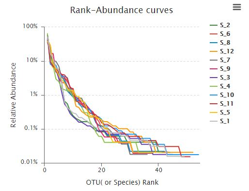
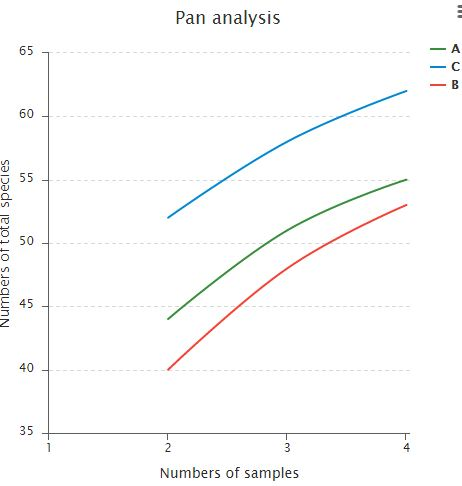
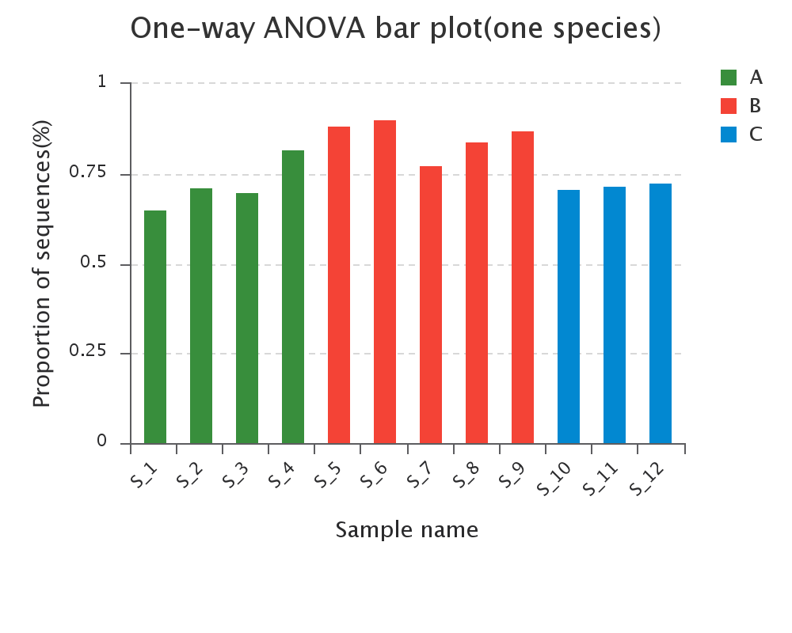
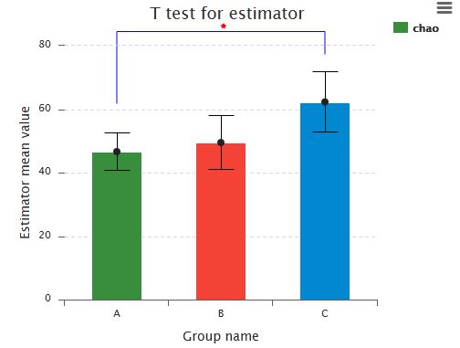
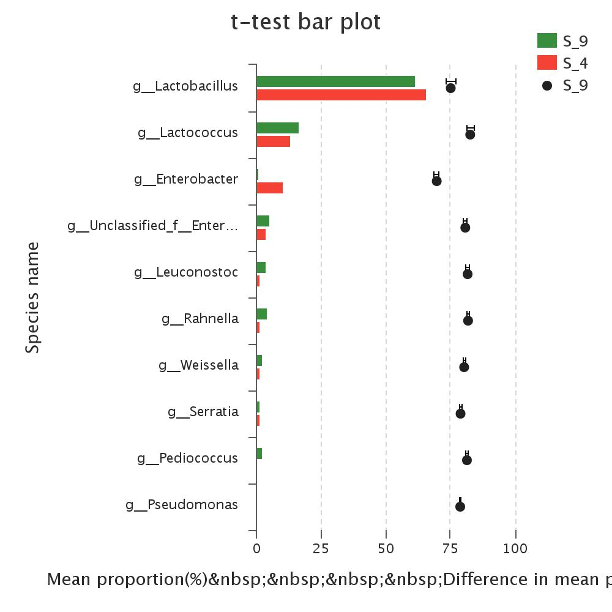

可视化模板
==========
#### | :bookmark:[散点图](#user-content-散点图) | :bookmark:[折线图](#user-content-折线图) | :bookmark:[柱状图](#user-content-柱状图) | :bookmark:[饼图](#user-content-饼图) | :bookmark:[箱线图](#user-content-箱线图) | :bookmark:[热力图](#user-content-热力图) | :bookmark:[关系图](#user-content-关系图) | :bookmark:[树状图](#user-content-树状图) |

## 散点图

| [PCA](/charts/pca)| [PCA_3d](/charts/pca_3d)|[PCA_3d](/charts/pca_3d)|
| -------------------------- |------------------------ |------------------------ |
| |       |       |
| [PCA](/charts/pca)| [PCA_3d](/charts/pca_3d)|[PCA_3d](/charts/pca_3d)|
| |       |      |

## 曲线图

| [Rank Abundance](/charts/curve/curve)| [Pan Core](/charts/curve/curve)|[PCA_3d](/charts/pca_3d)|
| -------------------------- |------------------------ |------------------------ |
|  |       |       |

## 柱状图

| [Normal Bar](/charts/bar/bar)| [T检验柱状图](/charts/bar/bar)|[差异检验柱状图](/charts/bar/bar)|
| -------------------------- |------------------------ |------------------------ |
| |       |       |

## 饼图

## 箱线图

## 热力图

## 关系图

## 树状图
