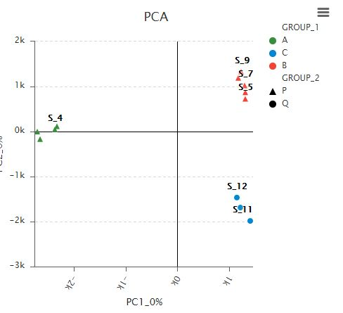

可视化模板
==========
| [散点图](#user-content-散点图) | [折线图](#user-content-折线图) | [柱状图](#user-content-柱状图) | [饼图](#user-content-饼图) | [箱线图](#user-content-箱线图) | [热力图](#user-content-热力图) | [关系图](#user-content-关系图) | [树状图](#user-content-树状图) |

# 散点图

| [PCA](/charts/pca)| [PCA_3d](/charts/pca_3d)|[PCA_3d](/charts/pca_3d)|
| -------------------------- |------------------------ |------------------------ |
| |       |       |
| [PCA](/charts/pca)| [PCA_3d](/charts/pca_3d)|[PCA_3d](/charts/pca_3d)|
| |       |      |

# 折线图

# 柱状图

# 饼图

#　箱线图

# 热力图

# 关系图

# 树状图
