## 样本集产品需求说明
+ [样本集概述](#user-content-样本集概述)
  + [样本集首页生信页面](#user-content-样本集首页生信页面)
   + [新建样本集](#user-content-新建样本集)
   + [重组](#user-content-重组)
   + [修改样本集名称](#user-content-修改样本集名称)
   + [使用样本集](#user-content-使用样本集)
   + [样本集日志](#user-content-样本集日志)
   + [样本集删除](#user-content-样本集删除)
   + [样本集详情](#user-content-样本集详情)
  + [样本集首页用户页面：](#user-content-样本集首页用户页面：)
   + [重组](#user-content-重组)
   + [修改样本集名称](#user-content-修改样本集名称)
   + [使用样本集](#user-content-使用样本集)
   + [样本集日志](#user-content-样本集日志)
   + [样本集删除](#user-content-样本集删除)
   + [样本集详情](#user-content-样本集详情)
 + [附录](#user-content-附录)
  + [新建样本集上传表格格式：](#user-content-新建样本集上传表格格式：)
  + [样本集信息修改页面上提供的信息](#user-content-样本集信息修改页面上提供的信息)
  + [样本集详情展示表](#user-content-样本集信息修改页面上提供的信息)
  + [微生物多样性质控数据统计](#user-content-微生物多样性质控数据统计)
  + [宏基因组质控数据统计表、原始数据统计表](#user-content-宏基因组质控数据统计表、原始数据统计表)
  + 有参转录组质控数据统计、原始数据统计(#user-content-样本集信息修改页面上提供的信息)
  + 待设计及待确认需求(#user-content-样本集信息修改页面上提供的信息)	  

  样本集顾名思义是样本的集合，主要实现样本及对应样本信息的存储、管理与统计功能。
样本集为平台通用功能，但因后续分析对接到多样性、有参转录组、无参转录组等流程，因此在设计上区分：用户权限与生信权限，属于不同流程的样本集参数或功能有相应的细微变化。

### 样本集概述
样本集首页涉及功能如下：新建样本集（仅生信权限）、样本集重组（生信权限：支持所有的样本集；客户权限：仅支持微生物多样性流程样本集）、样本集改名与备注、使用样本集入口（生信权限可选择所有流程进入参数设置页面，用户权限只能进入微生物多样性的参数设置页面而宏基因组和转录组应能直接进入交互分析页面）、样本集日志、删除样本集（仅创建人有删除权限），样本集详情。筛选：测序平台、分析类型、状态。检索：合同号、样本集名、样本集、创建时间等。1.1为样本集生信页面，1.2为样本集用户页面，1.3为附录，1.4为待设计或待确认的需求。

#### 样本集首页生信页面  
新建样本集、所有样本集均可重组、所有样本集前有复选框可勾选。

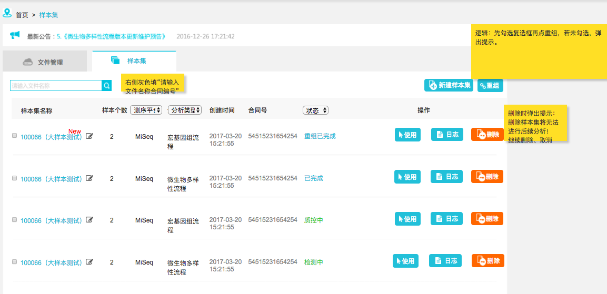
#### 新建样本集
点击[新建样本集]，进入新建样本集页面，提交后回到样本集首页。
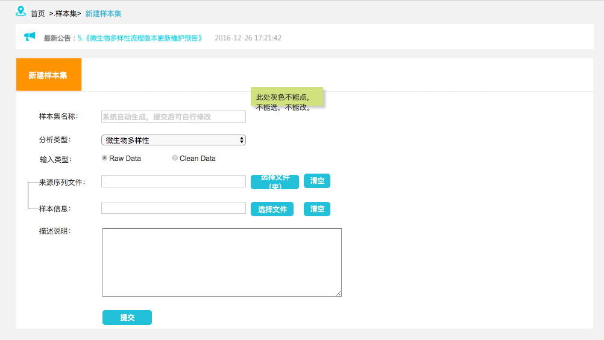
#### 重组
可对一个样本集中的全部或部分样本改名（改名一致即为合并样本），也可跨多个样本集中挑选样本重组。
样本集重组逻辑，先勾选样本集再点重组。若未勾选样本集点重组，生信页弹出提示如图:
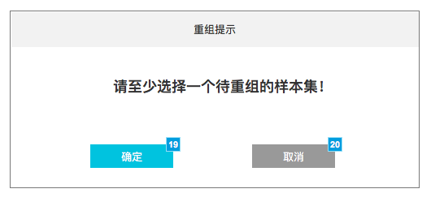

重组样本集分为两个步骤：第一步，挑选样本
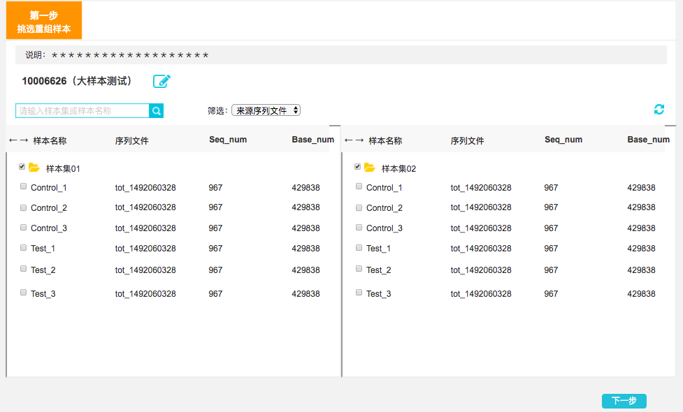
第二步，重命名（{-与排序？-}）。
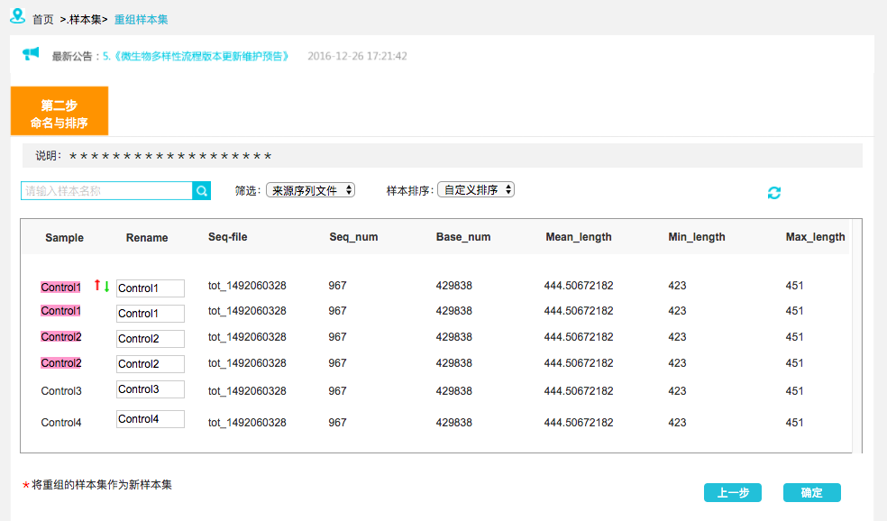
当重命名出现重名时，点击确定时提示：您的重组样本集中存在重名样本，确定后，系统将默认将重名样本合并！点击确定即合并样本，点击取消即回到原页面。
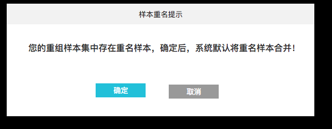

确定后弹出提示“新样本集XXX已建立成功”。点击确定回到样本集首页，且首页上样本集名后显示New。
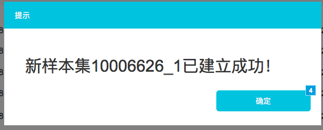
#### 修改样本集名称
修改样本集名称时弹出修改样本集名称弹框。点击确定回到首页。
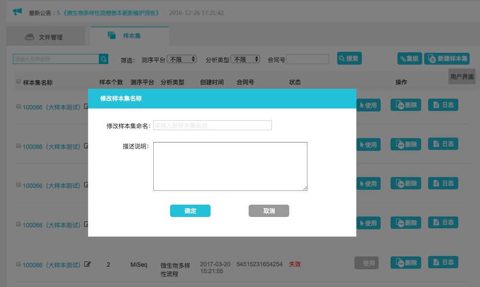
#### 使用样本集
生信使用样本集时默认单选样本集指定流程，如图生信9，也可做变更。点击确定进入流程参数设置页面，如图生信10，且样本集应直接带入流程的参数设置页面。
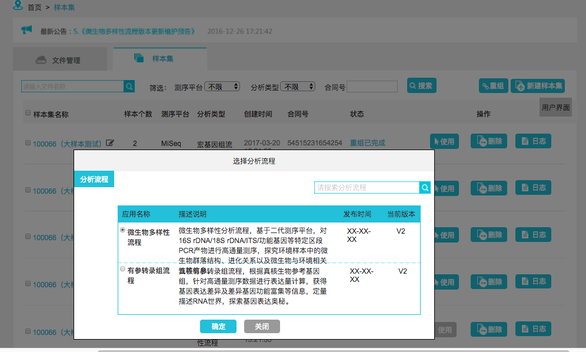

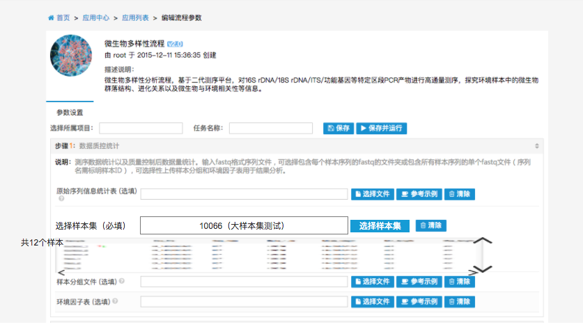
#### 样本集日志
日志中记录样本集的日志记录，包括：时间、日期、描述。日志：如果样本集中加入流程的质控环节，要增加，开始质控、质控成功 、质控失败、改修样本名、合并样本、修改样本集名等信息。详细信息（需要横纵向进度条）中记录由样本集11和样本集22重组生成。样本集A改名为样本集B。样本名XX改为XX等信息具体记录哪些信息需要更详细的提供，如图生信 11。
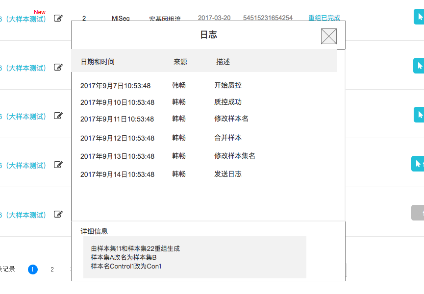

#### 样本集删除
样本集删除仅创建者可删除该样本集，点击样本集删除，应弹出删除提示：删除样本集将无法进行后续分析，如图生信12，点击确认删除即为删除，点击取消回到样本集首页。
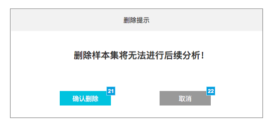

#### 样本集详情
样本集详情上半部分展示该样本集的OVERVIEW，以及各样本的详细信息（包括质控数据统计、原始数据统计，默认展示质控数据统计，微生物多样性样本集只有质控数据统计，其他流程的样本集包括质控数据统计和原始数据统计），如图生信13，实际低于合同数据量应高亮提示，因不同流程的样本集展示信息有差异，具体参见附录，以微生物多样性样本集为例。此外可通过输入样本名称进行检索。
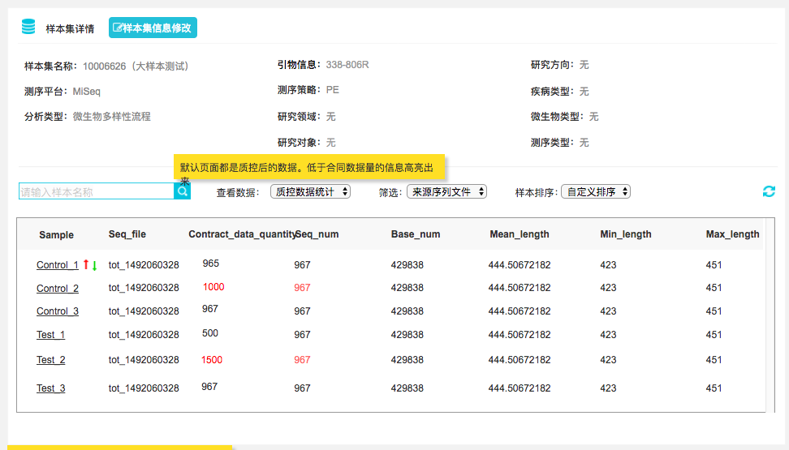

点击样本集信息修改，如图生信14，因各流程中的样本集信息修改内容不一致具体参加附录，以微生物多样性样本集为例。

以微生物多样性样本集为例，鼠标单击样本名时，出现备注的描述说明弹框，如图生信15。
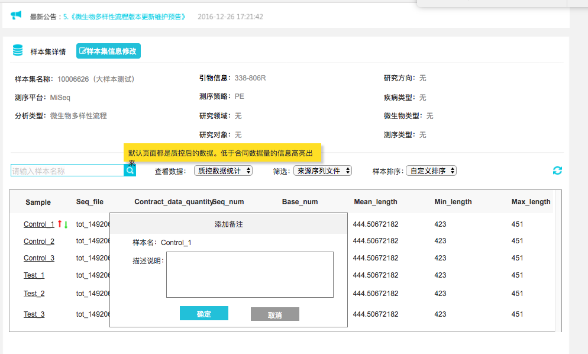

以微生物多样性样本集为例，鼠标悬停样本上出现样本信息：初始样本名、初始样本集、测序平台、引物信息、测序策略、所属合同、备注，如图生信16。
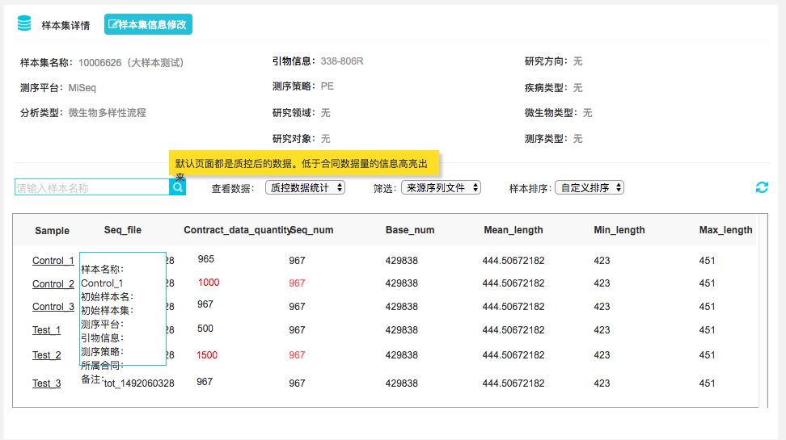

===============================================================================================================

### 样本集首页用户页面：
取消新建样本集，且只有微生物多样性样本集前有复选框可勾选用于重组样本集，如图用户1。
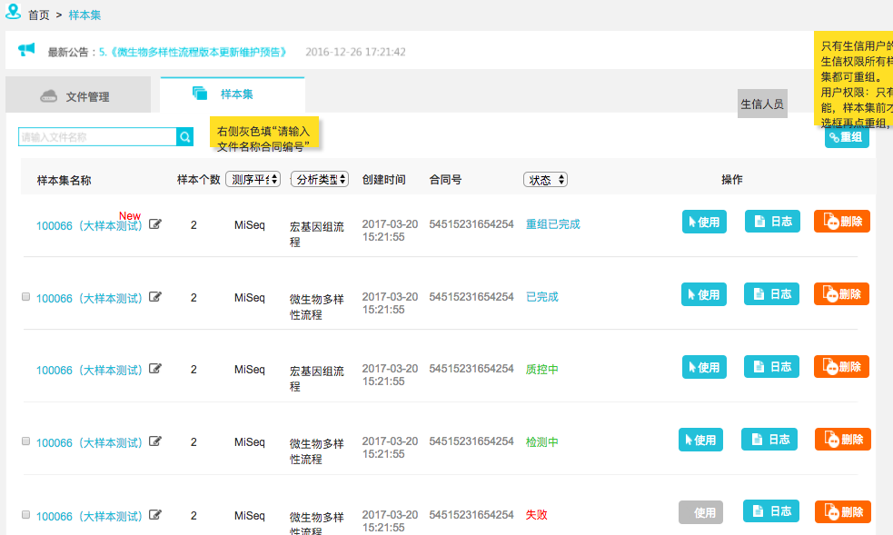

#### 重组
重组可对一个样本集中的全部或部分样本改名（改名一致即为合并样本），也可跨多个样本集中挑选样本重组。
样本集重组逻辑，先勾选样本集再点重组。若未勾选样本集点重组，用户页弹出提示如图用户2：
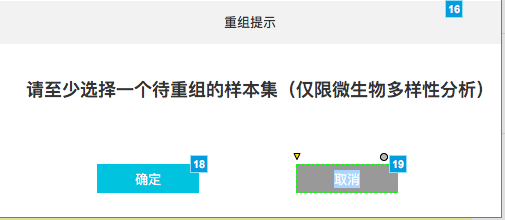

重组样本集分为两个步骤：第一步，挑选样本（图 用户3）；第二步，重命名（与排序待确认）（图用户4）。

当重命名出现重名时，点击确定时提示：您的重组样本集中存在重名样本，确定后，如图用户5，系统将默认将重名样本合并！点击确定即合并样本，点击取消即回到原页面。

确定后弹出提示“新样本集XXX已建立成功”，如图用户6。点击确定回到样本集首页，且首页上样本集名后显示New。

#### 修改样本集名称
修改样本集名称时弹出修改样本集名称弹框，如图用户7。点击确定回到首页。

#### 使用样本集
使用样本集时默认单选样本集指定流程如图用户8，现阶段只有微生物多样性流程能够进入参数设置页面。点击微生物多样性确定进入流程参数设置页面，如图用户9，且样本集应直接带入流程的参数设置页面。点击有参转录组确定应进入该样本集的交互分析页面，如图用户10。

#### 样本集日志
日志中记录样本集的日志记录：包括，时间、日期、描述。具体记录哪些信息需要更详细的提供，如图用户 11。日志：如果样本集中加入流程的质控环节，要增加，开始质控、质控成功 、质控失败、改修样本名、合并样本、修改样本集名等信息。详细信息（需要横纵向进度条）中记录由样本集11和样本集22重组生成。样本集A改名为样本集B。样本名XX改为XX等信息。具体记录哪些信息需要更详细的提供，如图用户11。

#### 样本集删除
样本集删除仅创建者可删除该样本集，点击样本集删除，应弹出删除提示：删除样本集将无法进行后续分析，如图用户12，点击确认删除即为删除，点击取消回到样本集首页。

#### 样本集详情
样本集详情上半部分展示该样本集的OVERVIEW，以及各样本的详细信息（包括质控数据统计、原始数据统计，默认展示质控数据统计，微生物多样性样本集只有质控数据统计，其他流程的样本集包括质控数据统计和原始数据统计），如图用户13。样本信息展示区应有纵向、横向进度条。因不同流程的样本集展示信息有差异，具体参见附录，以微生物多样性样本集为例。此外可通过输入样本名称检索。
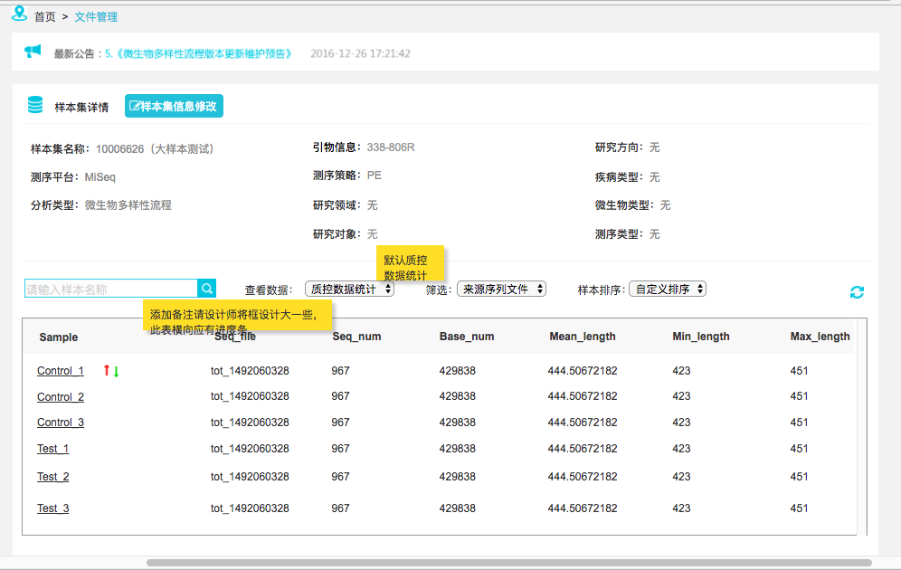

点击样本集信息修改，如图用户14，因各流程中的样本集信息修改内容不一致具体参加附录，以微生物多样性样本集为例。
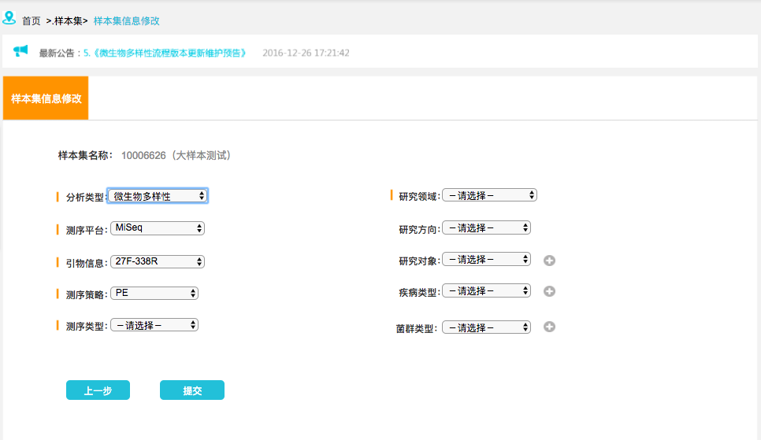

以微生物多样性样本集为例，鼠标单击样本名时，出现备注的描述说明弹框，如图 用户15。

以微生物多样性样本集为例，鼠标悬停样本上出现样本信息：初始样本名、初始样本集、测序平台、引物信息、测序策略、所属合同、备注，如图用户16。

===============================================================================================================

### 1.3附录
#### 新建样本集上传表格格式：
a)  微生物多样性：样本／测序平台／测序策略／引物／合同号／签订测序量／美吉编号
b)  宏基因组：样本／测序平台／测序策略／合同号／签订测序量／插入片段／微生物类型／Read1 file name/ Read2 file name （注：宏基因组微生物类型这列参数会影响到资源配置）
c)  RNA（有参、无参）：
样本／测序平台／测序策略／合同号／签订测序量／Read1 file name/ Read2 file name

#### 样本集信息修改页面上提供的信息
a)  以微生物多样性为例，如图附录1。具体细节见下述文字描述。
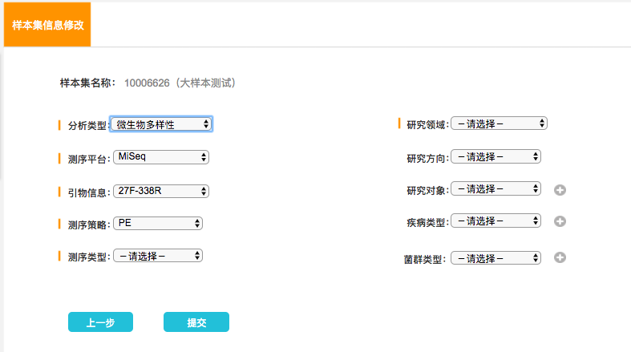

微生物多样性:
分析类型：微生物多样性   
测序平台：请选择  MiSeq   HiSeq  
引物信息：
请选择
27F-338R
27F-533R
515F-907R
338F-806R
ITS1F-ITS2R
1737F-2043R
ITS3F-ITS4R
SSU0817F-1196R
Arch344F-Arch915R
524F10extF-Arch958RmodR
515FmodF-806RmodR
515F-806R
ArBa515F-Arch806R
cd3aF-R3cdR
nirS4F-nirS6R
nifHF-nifHR
nifHForF-nifHRevR
nirK1aCuF-nirKR3CuR
bamoA1F-bamoA2R
amoAF-amoAR
MLfF-MLrR
AMV4.5NF-AMDGR
799F-1193R
其他
无

测序策略：请选择   PE     SE

测序类型：请选择   细菌16S rRNA    真菌ITS     真菌18S   反硝化细菌nirS
反硝化细菌    固氮菌nifH  固氮菌   亚硝酸盐还原基因    古菌    氨氧化细菌
氨氧化古菌    产甲烷菌mcrA    丛枝真菌    植物内生细菌    其他 无

研究领域： 请选择  医口   农口

选择医口时：
研究方向：
请选择 疾病类研究  非疾病类研究

研究对象：
请选择 人体  水产动物   家禽、家畜   反刍动物   小鼠    其他 无

疾病类型：
请选择 肥胖 糖尿病 胃肠道疾病 心血管疾病 自身免疫性疾病 神经系统疾病 精神疾病 呼吸道疾病 肝病 肿瘤 其他 无

菌群类型：
请选择 肠道菌群   消化道菌群（肠道除外）  口腔菌群   皮肤菌群   泌尿生殖道菌群   呼吸道菌群   母乳菌群   其他 无

选择农口时：
研究方向：
请选择 土壤环境    根际土壤   丛植菌根真菌（AMF）植物内生菌  水体环境
污水污泥  空气环境   家禽、家畜   反刍动物    其他 无

菌群类型：
请选择 土壤菌群    水体菌群    空气菌群    沉积物菌群    根际菌群    肠道菌群    皮肤菌群   口腔菌群   其他 无

b) 宏基因组
分析类型：宏基因组

测序平台：请选择  MiSeq   HiSeq  

测序策略：请选择   PE     SE

研究领域： 请选择  医口   农口

选择医口时：
研究方向：
请选择 疾病类研究  非疾病类研究

研究对象：
请选择 人体  水产动物   家禽、家畜   反刍动物   小鼠    其他 无

疾病类型：
请选择 肥胖 糖尿病 胃肠道疾病 心血管疾病 自身免疫性疾病 神经系统疾病 精神疾病 呼吸道疾病 肝病 肿瘤 其他 无

菌群类型：
请选择 肠道菌群   消化道菌群（肠道除外）  口腔菌群   皮肤菌群   泌尿生殖道菌群   呼吸道菌群   母乳菌群   其他 无

选择农口时：
研究方向：
请选择 土壤环境    根际土壤   丛植菌根真菌（AMF）植物内生菌  水体环境
污水污泥  空气环境   家禽、家畜   反刍动物    其他 无

菌群类型：
请选择 土壤菌群    水体菌群    空气菌群    沉积物菌群    根际菌群    肠道菌群    皮肤菌群   口腔菌群   其他

C）有参转录组 （D、无参转录组与有参转录组填写一致）

测序平台：请选择  MiSeq   HiSeq  

测序策略：请选择   PE     SE

研究领域：请选择  医口   农口

研究对象：请选择  动物 植物 真菌 原生生物 其他  无   

#### 样本集详情展示表
该表可能样本数目较多，也可能列数较多，因此需要横向、纵向均有进度条。

##### 微生物多样性质控数据统计表
仅有一张质控数据统计表，生信权限展示如图附录2-微生物多样性质控生信：
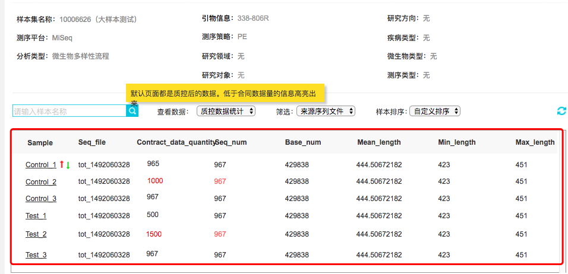

微生物多样性仅有一张质控数据统计表，用户权限展示如图附录2-微生物多样性质控（用户）：
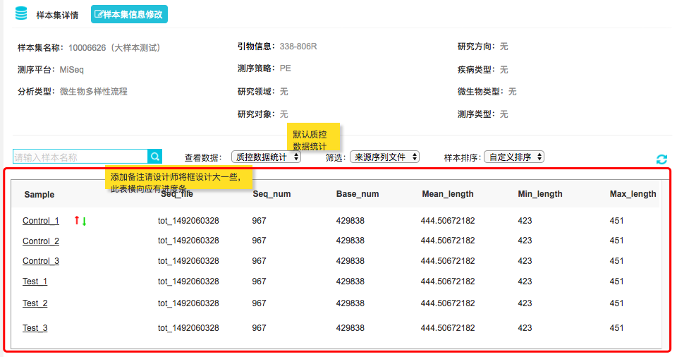

##### 宏基因组质控数据统计表、原始数据统计表
宏基因组样本集详情包括两张表：分别为质控数据统计表与原始数据统计表（区分用户与生信权限），样式与多样性质控数据统计保持一致即可，仅是表头变动。
宏基因组质控数据统计中生信页面需要展示内容如图 附录3-宏基因组质控数据统计（生信）：
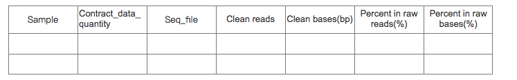

宏基因组原始数据统计中生信页面需要展示内容如图 附录4-宏基因组原始数据统计（生信）：
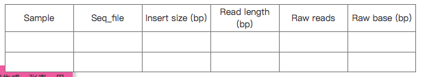

宏基因组质控数据统计中用户页面需要展示内容如图 附录5-宏基因组质控数据统计（用户）：
