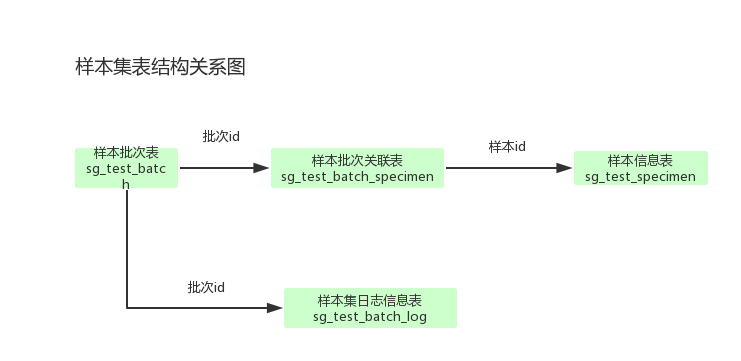

# 样本集表结构设计
### 样本集表结构设计

+ sg_test_batch（样本批次表）{-根据流程的不同，其中的参数设置也不同，此处仅例子，信息不全-}

| 列名 | 值 | 描述 |
| ---- | ---- | ---- |
|_id|Object()|批次表id|
|batch_sn|M1703140710|批次号|
|batch_name|XXX|样本集名称，对于一个用户来说，样本集的命名不能重复|
|member_id|Object()|会员id|
|detail|XXX|样本集的描述说明|
|is_delete|0|int,是否还在使用，0在用，1没在使用|
|status|end|样本集状态，在样本检测workflow操作完成后更新，前端新建样本集操作时默认为end|
|data_type||输入文件类型，raw_data/clean_data|
|created_ts|2016-02-23 16:03:29|创建时间|
|pipeline_tpye|meta|流程|
|platform||测序平台（HIseq/MIseq）|
|strategy||测序策略（PE/SE）|
|primer ||引物|
|seq_type||测序类型|

+ sg_test_specimen(样本信息表){-根据不同的流程，样本信息表中的字段会有所不同-}

| 列名 | 值 | 描述 |
| ---- | ---- | ---- |
|_id|Object()|样本id|
|file_path|rerewrweset/files/m_160/10000863/tot.fq|输入的序列文件名称|
|sample_path|rerewrweset/sample_data/XXX(样本id)/test_1.fa|样本文件路径|
|specimen_name|test_1|样本名称|
|sequence_num|1003|序列长度|
|base_num|433755|碱基长度|
|mean_length|432.2334|平均长度|
|min_length|400|最小长度|
|max_length|400|最大长度|
|pipeline_type|meta|流程|
|platform||测序平台（HIseq/MIseq）|
|strategy||测序策略（PE/SE）|
|primer ||引物|
|contract_number||合同号|
|contract_sequence_number||签订测序量|
|mj_munber||美吉编号|

+ sg_test_batch_specimen（样本批次关联表）

| 列名 | 值 | 描述 |
| ---- | ---- | ---- |
|_id|Object()|样本批次关联id|
|batch_id|Object()|批次id|
|specimen_id|Object()|样本id|
|alias_name|test_55|样本别名（页面展示的名称，默认是原名称，页面修改后则是修改后的名称）|
|desc||描述信息|
|recombination||list,组装的样本来源[batch_specimen_id]|

+ sg_test_batch_task(任务批次表)

| 列名 | 值 | 描述 |
| ---- | ---- | ---- |
|_id|Object()|任务批次表id|
|batch_id|Object()|批次id|
|task_id|Object()|任务id|

+ sg_test_batch_log(样本集日志信息表)

| 列名 | 值 | 描述 |
| ---- | ---- | ---- |
|_id|Object()|样本集日志id|
|batch_id|Object()|批次id|
|dec|‘开始质控’|日志描述|
|created_ts|2016-02-23 16:03:29|创建时间|
