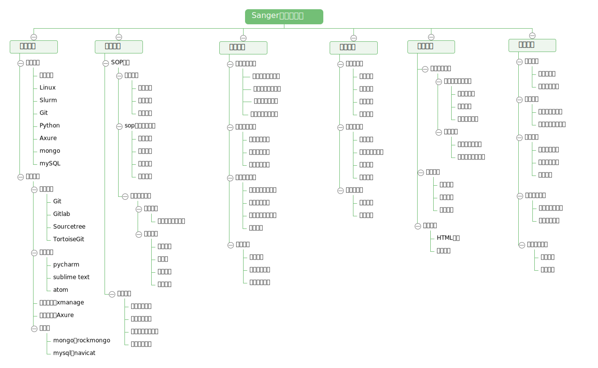

Sanger Biocluster 
======================

>                
> Welcome to a Sanger!
>              

桑格开发工作流
---------------

# 规范文档

### 集群使用

* 开发环境

	登录节点： 192.168.12.102 用户：sanger-dev，用户目录使用~/sg-users中个人目录,非个人目录中不要随意存放文件或删除文件
	
* 软件安装

	安装主目录目录：/mnt/ilustre/users/sanger-dev/app/
	- bioinfo/ 分析软件安装目录，其中通用型软件按功能类别安装在各个目录中，其他按产品类型安装在各自目录中，安装文件夹以'软件名-版本号'命名
	- database/	存放分析计算过程中软件需调用的生信数据库文件
	- gcc/ 各版本gcc编译器
	- install_packages/ 软件包安装目录
	- library/  安装软件时需要的linux库
	- program/	基础软件，编程语言等
	安装需记录下安装信息，在[AppInstall](AppInstall.md)中添加记录。

* 调试代码

	编写的代码进行调试时将修改的脚本拷到 ~/biocluster中相应位置，禁止整个文件夹复制，避免开发人员之间代码覆盖，互相影响。
	~/workspace 为测试运行数据结果目录。

### 开发编程

* Git & gitlab
	- 代码开发统一使用git库进行代码编写和提交;
	- 登录gitlba平台 git.majorbio.com 进行协作开发，受保护分支需进行merge request代码审核。

* 代码规范
	- 代码编写需进行Pep8检查，可以使用文本编辑器插件自动检查;
	- 注释信息简洁明晰;

### 流程解析PPT报告

	包含要点：分析功能、分析方法、软件命令、输入输出、文件内容和格式、命令参数、运行逻辑、运行测试情况（稳定性和资源耗用）。

### 方案设计

* 模块设计
* 原型制作

# 基础技能

* 集群系统

* Linux

* Slurm

* Git

* Python

* Axure

* Mongo

* MySQL

# 开发工具

* 代码提交
	- GIT
	- Sourcetree
	- TortoiseGit

* 代码编写
	- pycharm
	- sublime text
	- atom

* 集群使用
	- xmanage

* 原型制作
	- Axure

* 数据库
	- mongo:rockmongo
	- mysql:navicat
	

# 框架学习

# 开发模块

# 可视化模板

