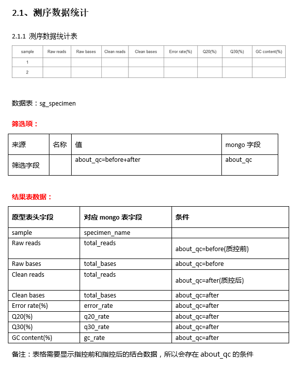

Sanger Bioinfo
======================

>                
> ### *Welcome to a Sanger !*                   [:flags: 生信模块库](/mbio)  |  [:eye_in_speech_bubble: 可视化模板库](/charts)  |  [:scroll:  Biocluster 教程](/biocluster)
>              

* [开发环境](#user-content-开发环境)
	+ [集群使用](#user-content-集群使用)
	+ [协作编程](#user-content-协作编程)
* [桑格开发工作流](#user-content-桑格开发工作流)
	+ [流程解析](#user-content-流程解析)
	+ [产品设计](#user-content-产品设计)
	+ [模块开发](#user-content-模块开发)
	+ [Web开发](#user-content-web开发)
	+ [测试发布](#user-content-测试发布)
* [基础技能](#user-content-基础技能)
* [开发工具](#user-content-开发工具)


# 开发环境

### 集群使用

登录节点： `192.168.12.102` 用户：`sanger-dev`，用户目录使用`~/sg-users`中个人目录,非个人目录中不要随意存放文件或删除文件

* 软件安装

	安装主目录目录：`/mnt/ilustre/users/sanger-dev/app/`
	- `bioinfo/` 分析软件安装目录，其中通用型软件按功能类别安装在各个目录中，其他按产品类型安装在各自目录中，安装文件夹以'软件名-版本号'命名
	- `database/`	存放分析计算过程中软件需调用的生信数据库文件
	- `gcc/` 各版本gcc编译器，根据需要添加版本
	- `install_packages/` 软件包安装目录
	- `library/`  安装软件时需要的linux库
	- `program/`	基础软件，编程语言等
	安装需记录下安装信息，在[AppInstall](AppInstallList)中添加记录。

	`bioinfo/`生信软件类别目录结构：
	```
	||-seq/ #与序列相关的软件
	|||-scripts/ #每个script目录表示我们自己编写的脚本存放的目录
	|||-fastx_toolkit_0.0.14
	||-meta/ #meta分析相关的软件存放目录
	|||-scripts/
	||-rna/ #rna分析相关的软件存放目录
	|||-scripts/
	||-phylogenetic/ #进化分析相关的软件存放目录
	|||-scripts/
	||-taxon/ #用于物种分类的软件存放目录
	|||-scripts/
	||-align/ #用于比对的软件存放目录
	|||-scripts/
	||-plot #用于画图可视化的软件存放目录
	|||-scripts/
	||-statistical #与统计相关的软件存放目录
	|||-scripts/
	||-annotation
	|||-scripts/
	||-gene-structure #基因结构相关软件存放目录
	|||-scripts/
	```


* 调试代码

	编写的代码进行调试时将修改的脚本拷到 `~/biocluster`中相应位置，禁止整个文件夹复制，避免开发人员之间代码覆盖，互相影响。
	`~/workspace` 为测试运行数据结果目录。


### 协作编程

* Git & gitlab
	- 代码开发统一使用git库进行代码编写和提交;
	- 登录[gitlba平台 git.majorbio.com](git.majorbio.com) 进行协作开发，受保护分支需进行merge request代码审核。


* 代码规范
	- 代码编写需进行[Pep8](https://www.python.org/dev/peps/pep-0008/)检查，可以使用文本编辑器插件自动检查;
	- 注释信息简洁明晰;


# 桑格开发工作流


### 流程解析
*	解析报告PPT要求：

	包含要点：分析功能、分析方法、软件命令、输入输出、文件内容和格式、命令参数、运行逻辑、运行测试情况（稳定性和资源耗用）。


### 产品设计

* 流程产品设计

	流程的一次分析包括：基础分析、交互分析、静态报告、结果目录。

	- 基础分析

	将分析过程设置为3-5个步骤，选定步骤中必须要设置的参数和选择设置的参数，参数关系避免过于复杂，参数在后台管理系统配置好后自动生成页面，但不包含参数关系，页面原型中需备注清楚参数关系。该部分分析一次性提交运行完成。

	- 交互分析

	交互分析页面主要包括：左侧分析目录，确认好目录层级；中间主要分析版面，包括半部分的参数设置区、下半部分结果区；右侧有结果记录弹出层。

	- 静态报告

	静态报告主要用于最终结果打印，可参考产品线结题报告。

	- 结果目录

	结果目录需确认分析类别文件夹名称和需要发送给客户的结果文件列表。

* 工具产品设计

	工具的一次分析包括：任务参数和结果页、结果目录。


* 模块设计
	- 单模块说明文档

	包含要点：模块路径Path、程序安装、功能描述、参数设计、运行逻辑
	参考示例：[blast Tool](/examples/blast)

	- workflow流程图

	包含要点：模块间上下游关系连接、module与tool之间的包含、File模块列表以及模块上file编号标注、模块开发者名字缩写标注、接口列表。
	建议使用[ProcessOn在线协作流程工具](https://www.processon.com)制作(加入`Sanger流程协作`小组)


### 模块开发
**注意事项：**
* 环境变量设置

	框架移除了本地环境变量加载（python以及library库目录部分会保留），tool如果依赖到本地环境变量，将会报错，按需在tool中加载环境变量，不使用.bash_profile配置环境变量

* 文件链接

	框架采用文件硬链的方式上传文件（上传地址和服务器系统在同一个文件系统），检查所有文件上传的目录，目录下的所有文件必须都是以硬链的方式链到该处，不可以有软链（软硬链说明：https://www.ibm.com/developerworks/cn/linux/l-cn-hardandsymb-links/）   python中的os.link()是硬链

* demo设置

	在`sanger_bioinfo\src\mbio\packages\meta\copy_demo.py` 中run函数中按规则添加代码；

	测试：
	`python ~/biocluster/bin/webapitest.py post meta/demo_mongodata_copy -c client01 -n "task_id;target_task_id;target_project_sn;target_member_id" -d "tsanger_2639;tsanger_2639_15;10000485_1;shenghe_test" -b http://192.168.12.102:8090`

> :wind_chime:note: otu_id,group_id,group_id,env_id, alpha_diversity_id以外的主表ID混用，非标准的主表detail表模式，自行添加修改代码。


### Web开发

* 可视化模板开发

	该部分由生信开发和系统开发合作开发。
	梳理流程交互报告中展示的图类型，参照[可视化模板库](/charts)已有模板，罗列出当前开发流程中可直接使用模板、需修改模板、需研发模板。
	> :wind_chime:note：修改和研发的模板需在模板库中更新或添加记录。

* 系统开发交接
	+ 数据库表结构设计文档

		测试机mongodb地址：`192.168.10.189`

		表结构参考示例：
		

	+ 需求文档：

		需求文档包括页面原型和分析图表表结构对应关系说明文档。

		文档中约定名词名称规则：

		- 页面筛选项：页面是否有筛选项，如果有会列出来。
		- 页面动态筛选：筛选项是从数据表中读取出来的(名称，对应的表，对应的字段)。动态筛选项一般存在主表里面
		- html标签
			- 文本框：```<input type=”text” name=”title” value=”图片标题”/>```
			- 复选框：```<input type=”checkbox” name=”title”/>是否选中```
			- 单选按钮：```<input type=”radio” name=”title“ />显示图例```
			- 下拉框：```<select name=”specimen_name”><option value=”L1”>L1</option><option value=”L2”>L2</option></select>```

		- 展示样式：对照的是原型里面的图表,根据对应的标题可以找到

		文档包括以下部分：

		- 概况说明:数据库名称、模板图说明(模板说明md文件[参考示例pca.md](/charts/pca)、图类型、js脚本)
		- 图表对应:流程各部分图表对应关系说明,分为数据表格和作图展示两种<br>
			**`数据表格`**：包括展示样式、数据表、筛选项、结果表,示例如下：
			<br>
			**`作图展示`**：包括展示样式、数据表、作图模板、筛选项、所需参数，示例如下：
			

* 接口编写


### 测试发布
相关负责人员：蓝英、王兆月，（注：协助测试员: 周玄、周茉莉、韩畅、曾静、宣红东，每次测试人员由蓝英按情况安排）
* Step 1 ：sg本地开发机

	相关开发人员自测试：网页端+生信端（蓝英确认并记录，没有自测不予通过）
* Step 2 ：tsg测试机

	页面测试：蓝英、王兆月（+协助测试员）
	生信测试：蓝英、石今（+协助测试员）
	尽可能在这一步解决大多数测试问题

* Step 3 ：tsanger预发布机

	确认推送内容项，安排网页端和生信端代码更新到tsanger，内部测试后通知产品线测试（蓝英+协助测试员+产品线测试人员）

* Step 4 ：sanger内部正式机

	测试完成安排网页端和生信端代码更新；
	蓝英线上测试检查；

* Step 5 ：i-sanger外部正式机

	推送外网更新。

 **Sanger平台更新规范**

	1. 普通功能需求按类型整理后2-3周更新一次；
	2. 问题bug和重要紧急的功能需求按实际情况及时更新推送；
	3. 大的改动功能需求和新增分析项按计划时间更新（与产品部确认推送时间），提前3-5天通知产品线预发布机测试，提前1天通知相关部门（产品线、营销部）更新内容；
	4. 重大变更更新推送时间安排在下班后1-2小时内完成，提前通知相关人员准备更新，更新前一天在平台上发提示更新的公告，告知用户将要更新维护的时间和内容；
	5. 每1-2周在平台发布更新内容公告。

**代码提交文档规范**

参考示例：

	PMS对应需求/bug id：
	需求/bug名称：
	开发人：
	web端相关开发人员：
	测试人员：
	简单说明：
	日期：

	集群软件安装配置（软件，python包，perl包，R包）：
		eg.
			软件名称：
			软件下载包路径：
			安装路径：
			安装命令：
			其他配置：

	接口端口号：

	提交代码列表（包含biocluster目录路径）：

	集群测试示例：
	eg.
		python ~/biocluster/bin/webapitest.py post meta/beta/multi_analysis -c client01 -n "analysis_type;otu_id;level_id;env_labs;distance_algorithm;env_id;task_type;submit_location;group_detail;group_id" -d "pca;579acd6aa4e1af8890b869af;8;ENV_1,ENV_2,ENV_3,ENV_4;bray_curtis;579acd6aa4e1af8890b869a2;reportTask;beta_multi_analysis_pca;/mnt/ilustre/users/sanger-dev/sg-users/hesheng/test/test_file/web_group_detail.txt;579acd6aa4e1af8890b869a0" -b http://192.168.12.102:8090


# 基础技能

* 集群系统
	- [集群原理及使用-郭权-20170322.ppt](/learn/集群原理及使用-郭权-20170322.ppt)
	- [集群原理简介-邱萍-20160601.ppt](/learn/集群原理简介-邱萍-20160601.ppt)

* Linux

* Slurm
	- [SLURM 安装与配置.pdf](/learn/SLURM 安装与配置.pdf)
	- [user_guide_slurm.pdf](/learn/user_guide_slurm.pdf)
	- [用 SLURM 优化超级计算机内的资源管理.pdf](/learn/用 SLURM 优化超级计算机内的资源管理.pdf)

* Git
	- [GIT使用1-20160520.pdf](/learn/GIT使用1-20160520.pdf)
	- [GIT使用2-20161223.pdf](/learn/GIT使用2-20161223.pdf)
	- [gitlab使用方法-20170322.pdf](/learn/gitlab使用方法-20170322.pdf)

* Python
	- [python教程-许挺151207.pptx](/learn/python教程-许挺151207.pptx)
	- [Python多线程-何胜20160415.pptx](/learn/Python多线程-何胜20160415.pptx)
	- [Python多线程与多进程-shenghe20160425.pdf](/learn/Python多线程与多进程-shenghe20160425.pdf)
	- [网页抓取 石今.pdf](/learn/网页抓取 石今.pdf)

* Axure
	- [交互分析原型设计-邱萍-20160715.ppt](/learn/交互分析原型设计-邱萍-20160715.ppt)

* Mongo
	- [mongo数据表设计基本规则.pptx](/learn/mongo数据表设计基本规则.pptx)

* MySQL

* Web
	- [html基础介绍20160425.ppt](/learn/html基础介绍20160425.ppt)
	- [CSS基础介绍-邱萍-20160429.ppt](/learn/CSS基础介绍-邱萍-20160429.ppt)
	- [javascript简介(1)-许挺-20160429.pptx](/learn/javascript简介(1)-许挺-20160429.pptx)
	- [highcharts-shenghe20160511.pdf](/learn/highcharts-shenghe20160511.pdf)
	- [d3基础  秦丹花 160506.ppt](/learn/d3基础  秦丹花 160506.ppt)

# 开发工具

* 代码提交
	- GIT
	- Sourcetree
	- TortoiseGit

* 代码编写
	- pycharm
	- sublime text
	- atom

* 集群使用
	- xmanage

* 原型制作
	- Axure

* 数据库
	- mongo: rockmongo
	- mysql: navicat
