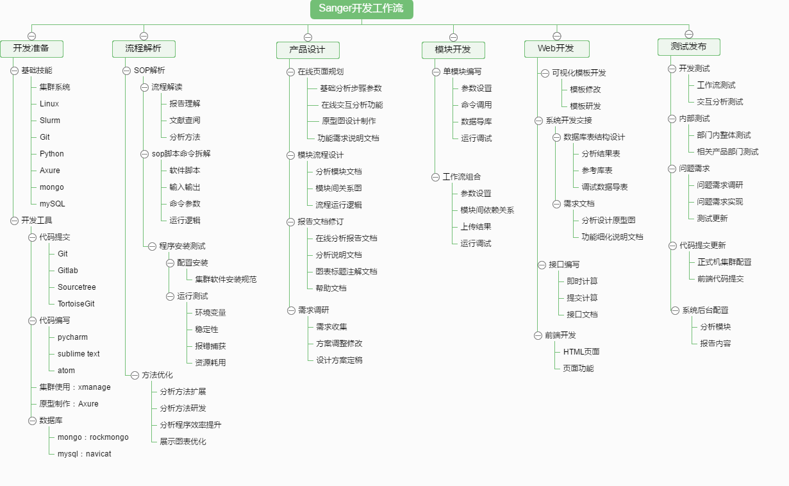
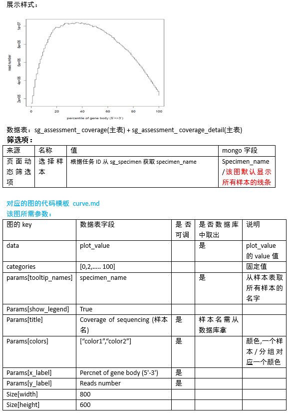

Sanger Bioinfo
======================

>                
> ## *Welcome to a Sanger !*                   
> ### [:flags: 生信模块库](/mbio)  |  [:eye_in_speech_bubble: 可视化模板库](/charts)  |  [:dagger: APP软件库](AppInstallList)  |  [:scroll:  Biocluster 教程](/biocluster)  |  [:key2: MD书写帮助](https://gitlab.com/gitlab-org/gitlab-ce/blob/master/doc/user/markdown.md)             


* [开发环境](#user-content-开发环境)
	+ [集群使用](#user-content-集群使用)
	+ [协作编程](#user-content-协作编程)
* [桑格开发工作流](#user-content-桑格开发工作流)
	+ [流程解析](#user-content-流程解析)
	+ [产品设计](#user-content-产品设计)
	+ [模块开发](#user-content-模块开发)
	+ [Web开发](#user-content-web开发)
	+ [测试发布](#user-content-测试发布)
    + [工具开发](#user-content-工具开发)
* [培训资料](#user-content-培训资料)
* [软件工具](#user-content-软件工具)


# 开发环境

### 集群使用

开发登录节点： `192.168.12.102` 用户：`sanger-dev`，用户目录使用`~/sg-users`中个人目录,非个人目录中不要随意存放文件或删除文件
开发节点对应web地址www.tsg.com

* 软件安装

	安装主目录目录：`/mnt/ilustre/users/sanger-dev/app/`
	- `bioinfo/` 分析软件安装目录，其中通用型软件按功能类别安装在各个目录中，其他按产品类型安装在各自目录中，安装文件夹以'软件名-版本号'命名
	- `database/`	存放分析计算过程中软件需调用的生信数据库文件
	- `gcc/` 各版本gcc编译器，根据需要添加版本
	- `install_packages/` 软件包安装目录
	- `library/`  安装软件时需要的linux库
	- `program/`	基础软件，编程语言等<br>
	:bellhop: 安装要求开发人员{-必须-}记录下安装信息，在[APP软件库](AppInstallList)中添加记录, 管理员会基于记录信息安装配置测试机与正式机。

	`bioinfo/`生信软件类别目录结构：
	```
	||-seq/ #与序列相关的软件
	|||-scripts/ #每个script目录表示我们自己编写的脚本存放的目录
	|||-fastx_toolkit_0.0.14
	||-meta/ #meta分析相关的软件存放目录
	|||-scripts/
	||-rna/ #rna分析相关的软件存放目录
	|||-scripts/
	||-phylogenetic/ #进化分析相关的软件存放目录
	|||-scripts/
	||-taxon/ #用于物种分类的软件存放目录
	|||-scripts/
	||-align/ #用于比对的软件存放目录
	|||-scripts/
	||-plot #用于画图可视化的软件存放目录
	|||-scripts/
	||-statistical #与统计相关的软件存放目录
	|||-scripts/
	||-annotation
	|||-scripts/
	||-gene-structure #基因结构相关软件存放目录
	|||-scripts/
	```
> :wind_chime:note: 该部分目录类别如有更改或新增，请对应更新上述列表。


* 调试代码

	编写的代码进行调试时将修改的脚本拷到 `~/biocluster`中相应位置，禁止整个文件夹复制，避免开发人员之间代码覆盖，互相影响。
	`~/workspace` 为测试运行数据结果目录。

	+ Tool调试
	+ Module调试
	+ Workflow调试
	+ 接口调试
	示例：
	```
	python ~/biocluster/bin/webapitest.py post meta/hierarchical_clustering_heatmap -c client01 -n "otu_id;level_id;group_id;group_detail;species_number;method;task_type;submit_location;sample_method;add_Algorithm" -d "586ef2c917b2bf6172bdfba0;9;586ef2c917b2bf6172bdfb6f;group_detail.txt;28;average;reportTask;hierarchical_clustering_heatmap;average;average" -b http://192.168.12.101:8091

	python ~/biocluster/bin/webapitest.py post meta/plot_tree -c client03 -n "otu_id;level_id;color_level_id;group_id;group_detail;task_type;submit_location" -d "5822b620a4e1af5a4ae9a795;8;3;5822b620a4e1af5a4ae9a787;plot_tree.txt;reportTask;plot_tree;" -b http://192.168.12.102:9090
	```


* 命令行数据上传

	从服务器上传数据到云平台目录。
	示例如下：
	```
	python ~/biocluster/scripts/dataexchange/get_file_list.py -i ~/sg-users/yuguo/testdata -o testdata.list
	python ~/biocluster/scripts/dataexchange/upload.py -l testdata.list -c FNSBGA -m tsanger

	python ~/biocluster/scripts/dataexchange/upload.py -l file.list -c NSOUKH -m tsanger
	python ~/biocluster/scripts/dataexchange/upload.py -l file.list -c NWKBVB
	```

* Slurm任务提交

	用户命令包括：sacct, salloc, sattach, sbatch, sbcast, scancel, scontrol, sinfo, smap, squeue,srun, strigger 和 sview.
	命令使用–help选项可以打印命令改命令的概要。需要注意的是命令选项都是大小写区分的。

	`sacct` 用来报告已经完成或正在进行作业或作业步骤的计费信息。

	`salloc`  用来实时分配作业资源。通常用来分配资源并生成一个终端shell。终端执行srun命令开始并行任务。

	`sattach` 用来连接正在执行任务的标准输入、输出、错误并带信号量接受功能。

	`sbatch` 用来提交作业脚本以便之后执行。这个脚本通常包含一个或多个srun命令来开始并行任务。

	`sbcast` 用来传输一个本地文件到已分配节点的本地磁盘。使用无盘的计算节点时候，相比共享的文件系统，这个可以大大提高性能。

	`scancel` 用来取消等待或者正在运行的任务和任务步骤。

	`scontrol` 为用来查看或修改Slurm状态的管理工具。需要注意的是许多scontrol的命令只能以root身份执行。

	`sinfo` 用来报告Slurm管理的节点和分区和节点状态。它包含各种过滤、排序和格式化的选项。

	`smap` 用来报告Slurm管理的作业、分区、节点的状态信息，只以图形化显示来反映网络拓扑信息。

	`squeue` 报告作业或作业步骤的状态。它包含各种过滤、排序、格式选项。默认情况下，它以优先级排序报告运行作业，然后以优先级排序报告等待作业。

	`srun` 用来实时提交运行作业，或者初始化作业步骤。srun含有各种指定需求资源的选项，包含：节点数量范围，处理器数量，指定使用或排除哪些节点以及指定节点的特性（如多少内存，磁盘空间，和其他一定的特性等）。一个作业可以在已分配节点的范围内包含多个顺序执行或独立/共享资源并行执行的作业步骤.

	`strigger` 用来设置，获取或查看时间触发器。时间触发器包含例如节点down机或作业达到时间限制等。

	`sview` 为获取或更新Slurm管理的作业、分区、节点的状态信息。


### 协作编程

* Git & gitlab
	- 代码开发统一使用git库进行代码编写和提交;
	- 登录[gitlba平台 git.majorbio.com](git.majorbio.com) 进行协作开发，受保护分支需进行merge request代码审核。

	**任何开发必须在gitlab上对应一条issue，代码分支上编写进行，编写测试完成提交最后更新时关闭issue。**

	建立分支命名规则如下：

	- 线上bug修复 ： bugfix-xxx
	- 线上已有功能优化： update-xxx
	- 新分析新功能： feature-xxx
	- 流程： 按具体流程命名
	> note: 注意经常commit代码，与他人开发相关时需要经常push以便于相互更新，master或项目主分支上代码有更新时，注意将最新代码并入当前开发的分支，保持开发代码环境的最新，避免后续冲突或问题过多。

* 代码规范
	- 代码编写需进行[Pep8](https://www.python.org/dev/peps/pep-0008/)检查，可以使用文本编辑器插件自动检查;
	- 注释信息简洁明晰;


# 桑格开发工作流


### 流程解析
*	解析报告PPT要求：

	包含要点：分析功能、分析方法、软件命令、输入输出、文件内容和格式、命令参数、运行逻辑、运行测试情况（稳定性和资源耗用）。


### 产品设计

* 流程产品设计

	流程的一次分析包括：基础分析、交互分析、静态报告、结果目录。

	- 基础分析

	将分析过程设置为3-5个步骤，选定步骤中必须要设置的参数和选择设置的参数，参数关系避免过于复杂，参数在后台管理系统配置好后自动生成页面，但不包含参数关系，页面原型中需备注清楚参数关系。该部分分析一次性提交运行完成。

	- 交互分析

	交互分析页面主要包括：左侧分析目录，确认好目录层级；中间主要分析版面，包括半部分的参数设置区、下半部分结果区；右侧有结果记录弹出层。

	- 静态报告

	静态报告主要用于最终结果打印，可参考产品线结题报告。

	- 结果目录

	结果目录需确认分析类别文件夹名称和需要发送给客户的结果文件列表。

* 工具产品设计

	工具的一次分析包括：任务参数和结果页、结果目录。


* 模块设计
	- 单模块说明文档

	包含要点：模块路径Path、程序安装、功能描述、参数设计、运行逻辑
	参考示例：[blast Tool](/examples/blast)<br>
	:bellhop: 模块开发时所有模块{-必须-}对应一个md格式模块说明文档。

	- workflow流程图

	包含要点：模块间上下游关系连接、module与tool之间的包含、File模块列表以及模块上file编号标注、模块开发者名字缩写标注、接口列表。
	建议使用[ProcessOn在线协作流程工具](https://www.processon.com)制作(加入`Sanger流程协作`小组)


### 模块开发

生信模块包括： workflow、module、Tool、File

**注意事项：**
* 环境变量设置

	框架移除了本地环境变量加载（python以及library库目录部分会保留），tool如果依赖到本地环境变量，将会报错，按需在tool中加载环境变量，不使用.bash_profile配置环境变量

* 文件链接

	框架采用文件硬链的方式上传文件（上传地址和服务器系统在同一个文件系统），检查所有文件上传的目录，目录下的所有文件必须都是以硬链的方式链到该处，不可以有软链（软硬链说明：https://www.ibm.com/developerworks/cn/linux/l-cn-hardandsymb-links/）   python中的os.link()是硬链

* 数据库连接
	1. mbio目录下的模块数据库访问必须使用：from bioclusterconfig import Config
	    - 连接mongo数据库时，必须从Config中获取，目前有两种数据库连接，一是Config().mongo_client，是分析结果mongo数据库连接，二是Config().biodb_mongo_client，是生信参考数据库，如：KEGG数据库、NCBI物种分类、COG数据库等等。
	    - 连接mysql数据库时，也必须从Config中获取，使用Config().get_db()方法获取连接对象。一般情况下，mysql在模块开发时没有必要使用，使用时请确认必要性。
	2. webroot目录下模块数据库访问使用：from webroot.mainapp.config.db import Config
	    - mongo数据库两种连接方式分别是Config().get_mongo_client()返回分析结果数据库连接，Config().get_biodb_mongo_client()返回生信参考数据库连接
	    - 连接mysql数据库从Config中获取，使用Config().get_db()方法获取连接对象。


* demo设置

	在`sanger_bioinfo\src\mbio\packages\meta\copy_demo.py` 中run函数中按规则添加代码；

	测试：
	`python ~/biocluster/bin/webapitest.py post meta/demo_mongodata_copy -c client01 -n "task_id;target_task_id;target_project_sn;target_member_id" -d "tsanger_2639;tsanger_2639_15;10000485_1;shenghe_test" -b http://192.168.12.102:8090`<br>
	> :wind_chime:note: otu_id,group_id,group_id,env_id, alpha_diversity_id以外的主表ID混用，非标准的主表detail表模式，自行添加修改代码。


### Web开发

* 可视化模板开发

	该部分由生信开发和系统开发合作开发。
	梳理流程交互报告中展示的图类型，参照[可视化模板库](/charts)已有模板，罗列出当前开发流程中可直接使用模板、需修改模板、需研发模板。
	> :wind_chime:note：修改和研发的模板需在模板库中更新或添加记录。

* 系统开发交接
	+ 数据库表结构设计文档

		测试机mongodb地址：`192.168.10.189`

		表结构参考示例：
		

	+ 需求文档：

		需求文档包括页面原型和分析图表表结构对应关系说明文档。

		文档中约定名词名称规则：

		- 页面筛选项：页面是否有筛选项，如果有会列出来。
		- 页面动态筛选：筛选项是从数据表中读取出来的(名称，对应的表，对应的字段)。动态筛选项一般存在主表里面
		- html标签
			- 文本框：```<input type=”text” name=”title” value=”图片标题”/>```
			- 复选框：```<input type=”checkbox” name=”title”/>是否选中```
			- 单选按钮：```<input type=”radio” name=”title“ />显示图例```
			- 下拉框：```<select name=”specimen_name”><option value=”L1”>L1</option><option value=”L2”>L2</option></select>```

		- 展示样式：对照的是原型里面的图表,根据对应的标题可以找到

		文档包括以下部分：

		- 概况说明:数据库名称、模板图说明(模板说明md文件[参考示例pca.md](/charts/pca)、图类型、js脚本)
		- 图表对应:流程各部分图表对应关系说明,分为数据表格和作图展示两种<br>
			**`数据表格`**：包括展示样式、数据表、筛选项、结果表,示例如下：
			<br>
			**`作图展示`**：包括展示样式、数据表、作图模板、筛选项、所需参数，示例如下：
			

* 接口编写


### 测试发布

开发机（102）上开发调试完成后，提交最新更新到当前分支后开始进入测试，**测试由各项目负责人安排跟进**。

* Step 1 ：102-sg 开发调试

	相关开发人员自测试，双方没有问题通知web开发推送代码到tsg

* Step 2 ：102-tsg 测试

	全面测试并解决问题，包括分析计算和页面各个部分，bug类更新测完即推送代码到tsanger，其他按计划推送时间推送。

* Step 3 ：tsanger预发布测试

	网页端通知更新代码到tsanger，生信端开发员发起meger request合并代码到master，由指定更新人员负责合并代码更新到tsanger，进行相关配置，有问题时开发人员通过ftp拉取日志和文件后配合更新人员调试。
	内部测试后通知产品业务部门测试，通过后准备上线推送sanger

* Step 4 ：更新sanger和i-sanger

	由指定更新人员进行正式机的安装配置和代码更新，准备妥当后推送网页端代码到i-sanger。

> note: 正式机推送需按情况选择时间，如对线上使用造成影响则安排在下班时间或周末，并同时开启维护页面。


**代码提交文档规范**

参考示例：

	PMS对应需求/bug id：
	需求/bug名称：
	开发人：
	web端相关开发人员：
	测试人员：
	简单说明：
	日期：

	集群软件安装配置（软件，python包，perl包，R包）：
		eg.
			软件名称：
			软件下载包路径：
			安装路径：
			安装命令：
			其他配置：

	接口端口号：

	提交代码列表（包含biocluster目录路径）：

    新collection以及索引：
    例如： sanger.sg_example          index: task_id, otu_id
          sanger.sg_example_detail   index: sg_example_id

	集群测试示例：
	eg.
		python ~/biocluster/bin/webapitest.py post meta/beta/multi_analysis -c client01 -n "analysis_type;otu_id;level_id;env_labs;distance_algorithm;env_id;task_type;submit_location;group_detail;group_id" -d "pca;579acd6aa4e1af8890b869af;8;ENV_1,ENV_2,ENV_3,ENV_4;bray_curtis;579acd6aa4e1af8890b869a2;reportTask;beta_multi_analysis_pca;/mnt/ilustre/users/sanger-dev/sg-users/hesheng/test/test_file/web_group_detail.txt;579acd6aa4e1af8890b869a0" -b http://192.168.12.102:8090


### 工具开发

工具开发需要完成的内容有以下几点(以下说明中tool代表tool和module甚至包含workflow)：
1. 工具的独立性确认与功能完善：工具可能开发时被用于其他module/workflow，导致工具的设计偏向，例如：PCA工具开始只可以适用于OTU表(特征在行为OTU)，需要修改增加行列参数。
2. 工具的api接口：工具由pipeline(工作流接收端口)提交到WPM服务，服务在tool上层添加SingleWorkflow包装运行tool；需要编写一个api/database导表，完成tool结果导入mongo数据库；当前(暂时)调用方式为SingleWorkflow自动调用api/database/toolapps相对导表模块路径与tool模块相对mbio路径相同的模块。例如：src/mbio/tools/meta/beta_diversity/pca.py工具调用src/mbio/api/database/toolapps/tools/meta/beta_diversity/pca.py实例化Pca对象，运行run函数。简化代码如下：

	```
	    class Pca(Base):
	        def __init__(self, bind_object):
	            super(Pca, self).__init__(bind_object)
	            self.output_dir = self.bind_object.output_dir
	            self._db_name = 'toolapps'
	            self.check()
	        @report_check
	        def run(self):
	            self.main_id = self.scatter_in()
	            self.table_ids = self.table_in()
	            return self.main_id
	```
3. mongo数据表的设计：工具表设计角度与分析不同，数据不考虑分析，只考虑分析的展示形式，例如：散点数据，venn数据，表格数据，柱图数据等等，结果表导入mongo中时按照对应的展示类型导入即可，新的展示类型数据需要重新设计展示类型的结构，此处需要慎重，设计尽量完整，对图形展示有良好的抽象。
4. 其他注意事项：tool报错信息确认，不能偏向某个流程说明，例如PCA报错不要说OTU表格式错误；网页的描述有三类，一是分析的参数整体说明；二是各个参数的说明；三是文件格式说明，不能把文件的格式说明偏向分析内容，文件格式是通用的。

# 培训资料

* 平台开发
	- [交互分析原型设计及可视化模板开发-邱萍-20160715.ppt](/learn/交互分析原型设计及可视化模板开发-邱萍-20160715.ppt)
	- [框架理论简介-许挺-201607.pptx](/learn/框架理论简介-许挺-201607.pptx)
	- [测试机使用和开发注意事项-何胜20170421.pptx](/learn/测试机使用和开发注意事项-何胜20170421.pptx)
	- [模块开发流程规范--何胜20160721.pdf](/learn/模块开发流程规范--何胜20160721.pdf)
	- [后台管理系统使用 秦丹花 20160715.ppt](/learn/后台管理系统使用 秦丹花 20160715.ppt)

* 集群系统
	- [集群原理及使用-郭权-20170322.ppt](/learn/集群原理及使用-郭权-20170322.ppt)
	- [集群原理简介-邱萍-20160601.ppt](/learn/集群原理简介-邱萍-20160601.ppt)

* Slurm
	- [SLURM 安装与配置.pdf](/learn/SLURM 安装与配置.pdf)
	- [user_guide_slurm.pdf](/learn/user_guide_slurm.pdf)
	- [用 SLURM 优化超级计算机内的资源管理.pdf](/learn/用 SLURM 优化超级计算机内的资源管理.pdf)

* Git
	- [GIT使用1-20160520.pdf](/learn/GIT使用1-20160520.pdf)
	- [GIT使用2-20161223.pdf](/learn/GIT使用2-20161223.pdf)
	- [gitlab使用方法-20170322.pdf](/learn/gitlab使用方法-20170322.pdf)

* Python
	- [python教程-许挺151207.pptx](/learn/python教程-许挺151207.pptx)
	- [Python多线程-何胜20160415.pptx](/learn/Python多线程-何胜20160415.pptx)
	- [Python多线程与多进程-shenghe20160425.pdf](/learn/Python多线程与多进程-shenghe20160425.pdf)
	- [网页爬虫-石今-20170420.pptx](/learn/网页爬虫-石今-20170420.pptx)
	- [正则表达式-金林芳-20170413.pptx](/learn/正则表达式-金林芳-20170413.pptx)

* Axure
	- [交互分析原型设计-邱萍-20160715.ppt](/learn/交互分析原型设计-邱萍-20160715.ppt)

* Mongo
	- [mongo数据表设计基本规则.pptx](/learn/mongo数据表设计基本规则.pptx)

* MySQL

* Web
	- [html基础介绍20160425.ppt](/learn/html基础介绍20160425.ppt)
	- [CSS基础介绍-邱萍-20160429.ppt](/learn/CSS基础介绍-邱萍-20160429.ppt)
	- [javascript简介(1)-许挺-20160429.pptx](/learn/javascript简介(1)-许挺-20160429.pptx)
	- [highcharts-shenghe20160511.pdf](/learn/highcharts-shenghe20160511.pdf)
	- [d3基础  秦丹花 160506.ppt](/learn/d3基础  秦丹花 160506.ppt)

# 软件工具

* 代码提交
	- GIT
	- Sourcetree
	- TortoiseGit

* 代码编写
	- pycharm
	- sublime text
	- atom

* 集群使用
	- xmanage

* 原型制作
	- Axure

* 数据库
	- mongo: rockmongo
	- mysql: navicat
